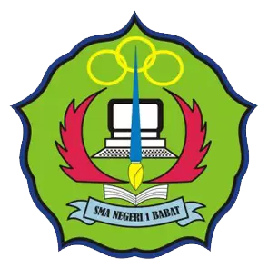

<p align="center">
    
</p>

<h1 align="center">SIMLAB SMABA</h1>

<p align="center">
    <strong>Sistem Informasi Manajemen Laboratorium SMA Negeri 1 Babat</strong>
</p>

<p align="center">
    <a href="https://laravel.com"></a>
    <a href="https://tailwindcss.com"></a>
    <a href="https://alpinejs.dev"></a>
</p>

---

## 📖 Tentang Aplikasi

**SIMLAB SMABA** adalah platform digital yang dirancang untuk memodernisasi pengelolaan laboratorium di SMA Negeri 1 Babat. Sistem ini mendigitalkan proses peminjaman ruang, inventaris alat, hingga pelaporan, meninggalkan cara manual berbasis kertas demi efisiensi dan akurasi data.

## ✨ Fitur Unggulan

### 1. 📅 Manajemen Peminjaman (Booking Lab)
- **Kalender Interaktif**: Cek ketersediaan lab secara real-time.
- **Booking Online**: Guru dapat mengajukan peminjaman lab dari mana saja.
- **Konflik Jadwal Otomatis**: Sistem menolak booking jika jadwal bentrok.

### 2. 📱 Tanda Tangan Digital (TTE)
- **QR Code Verification**: Surat peminjaman dilengkapi QR Code unik.
- **Halaman Verifikasi Publik**: Scan QR untuk memvalidasi keaslian dokumen secara online tanpa login.

### 3. 📦 Manajemen Inventaris
- Pencatatan alat dan bahan laboratorium.
- Status kondisi barang (Baik, Rusak, Hilang).

### 4. 📊 Laporan & Analitik
- **Grafik Tren**: Visualisasi data peminjaman bulanan dan alat terpopuler.
- **Export Excel**: Unduh rekapitulasi laporan bulanan dalam format `.xlsx` untuk administrasi sekolah.

### 5. 🔒 Keamanan Tingkat Lanjut
- **Session Timeout**: Otomatis mengunci layar (Lock Screen) jika tidak ada aktivitas selama 5 menit.
- **Blur Effect**: Menjaga privasi tampilan saat sesi terkunci.

## 🛠️ Teknologi yang Digunakan

- **Backend**: Laravel 10 (PHP)
- **Frontend**: Blade, Tailwind CSS, Alpine.js
- **Database**: MySQL
- **Library Pendukung**: 
  - `simplesoftwareio/simple-qrcode` (Tanda Tangan Digital)
  - `maatwebsite/excel` (Export Laporan)
  - `fullcalendar` (Jadwal Lab)

## 🚀 Instalasi Lokal

1. **Clone Repository**
   ```bash
   git clone https://github.com/dioalifal0208/Simlab-SMABA.git
   cd Simlab-SMABA
   ```

2. **Install Dependencies**
   ```bash
   composer install
   npm install && npm run build
   ```

3. **Setup Environment**
   - Copy `.env.example` ke `.env`
   - Konfigurasi database di `.env`
   ```bash
   cp .env.example .env
   php artisan key:generate
   ```

4. **Migrasi Database**
   ```bash
   php artisan migrate --seed
   ```

5. **Jalankan Aplikasi**
   ```bash
   php artisan serve
   ```

---

<p align="center">
    Dikembangkan oleh <strong> Dio Indrawan - SMA Negeri 1 Babat</strong> © 2026
</p>
